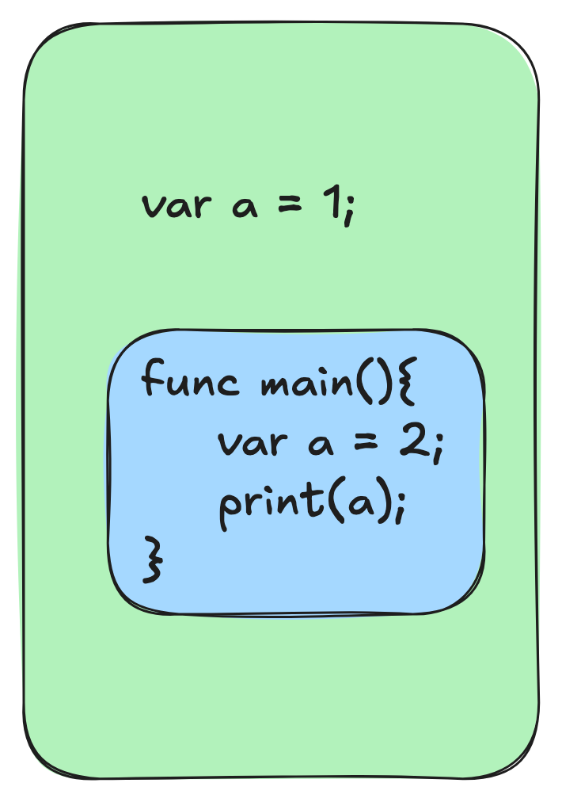

# User Guide

Welcome to the custom script language **ZERO**\! This is a lightweight, C-style, dynamically typed scripting language that supports object mapping and high-order function calls.

-----

## 1\. Getting Started

### Building from Source

ZERO is composed of only four core source files, making it extremely easy to build from scratch:

  - `zero.h`
  - `vec.h` & `vec.c`
  - `map.h` & `map.c`
  - `main.c`

#### Using GN

```bash
gn gen out --args="is_debug=true"
ninja -C out
```

#### Using CMake

```bash
mkdir cmake_out
cd cmake_out
cmake ..
make
```

Once built, you will get a virtual machine executable named `zero`. Use `zero -h` to see usage details:

```bash
zero -h

* * * * * * * * * * * * * * * * * * * **
* ______  ______   _____     ____    *
* |___  / | _____| |  __ \   / __ \   *
* / /  | |__    | |__) | | |  | |  *
* / /   |  __|   |  _  /  | |  | |  *
* / /__  | |____  | | \ \  | |__| |  *
* /_____| |______| |_|  \_\  \____/   *
* LMM*
* * * * * * * * * * * * * * * * * * * **

Usage: zero [options] <input_file>

Options:
  -h, --help              Show this help message
  -v, --version           Display version information
  -i, --input <file>      Specify the input files

Example:
  zero -i main.z
```

-----

## 2. Hello World

ZERO source files use the `.z` extension. Create a file named `hello_world.z`:

```bash
touch hello_world.z
```

Add the following code:

```js
func main(){
    print("Hello World!");
}
```

Like C, ZERO requires a `main` function as the program entry point. The built-in `print` function handles standard output. Run it using: `zero -i hello_world.z`.

-----

## 3. Scopes: Global vs. Local

</img>

ZERO distinguishes between global and local environments. In a source file, the **global scope** allows only three types of statements: **function definitions**, **variable declarations**, and **type definitions**.

> **Note:** Currently, global variables only support literal initialization (e.g., `var a = 1;`). Complex expressions like `var a = 1 + 2;` are not yet supported in the global scope but will be in future updates.

Local variables can shadow global variables with the same name:

```js
var a = 1; // Global
func main(){
    var a = 2; // Local shadows global
    print(a); // Output: 2
}
```

-----

## 4. Basic Variables & Data Types

Use the `var` keyword to declare variables. ZERO is **dynamically typed**.

### Primitive Types

```js
var a = 1;          // Integer
var b = false;      // Boolean
var c = 1.2;        // Float
var d = "Hello";    // String
```

These are **value types**. When passed to a function, they are copied. Changes made inside the function do not affect the original variable.

To use reference-based primitives, include the standard library:

```js
include("std");

func main(){
    var a_ref = Int(1);
    var b_ref = Int(2);
    swap(a_ref, b_ref);
    print(a_ref); // Output: 2
}
```

### Dictionaries (Objects)

Dictionaries are **reference types**.

```js
var o = {"name":"zero", "age": 2.5};
print(o); // {"name":"zero", "age":2.500000}
```

### Arrays

Arrays are also reference types (currently in beta/under development).

```js
var o = [1, 2.5, "zero"];
print(o); // [1, 2.500000, "zero"]
```

-----

## 5. Function Definitions

Functions are defined using the `func` keyword.

```javascript
// Function without parameters
func sayHi() {
    print("hi");
}

// Function with parameters
func action(name, num) {
    while (num > 0) {
        print(name);
        num = num - 1;
    }
}
```

-----

## 6. Control Flow

### While Loop

ZERO uses `while` for loops. Increment/decrement operators (like `b--`) are not yet supported; use explicit assignment instead.

```javascript
func loop(a, b) {
    while (b > 0) {
        print(a * 1);
        b = b - 1; 
    }
}
```

-----

## 7. Advanced Features: Objects & Methods

Functions are first-class citizens. You can store functions in objects and invoke them using **dot notation (`.`)**, which supports deep chain access.

### Example: Nested Objects and Methods

```javascript
func action(title, count){
    while (count > 0) {
        print(title);
        count = count - 1; 
    }
}

func main() {
    // 1. Store function in an object
    var human = {"run" : action};
    
    // 2. Nested object
    var all = {"owner" : human};
    
    // 3. Chained access and execution
    all.owner.run("owner running", 3);
}
```

-----

## 8. Comments

  * **Single-line**: `// comment`
  * **Multi-line**: `/* block comment */`

-----

## 9. Standard Library Containers (std)

Explore the usage of built-in containers through the test files:

1.  [List](./test/list_test.z)
2.  [Map](./test/map_test.z)
3.  [Queue](./test/queue_test.z)
4.  [Stack](./test/stack_test.z)

-----
